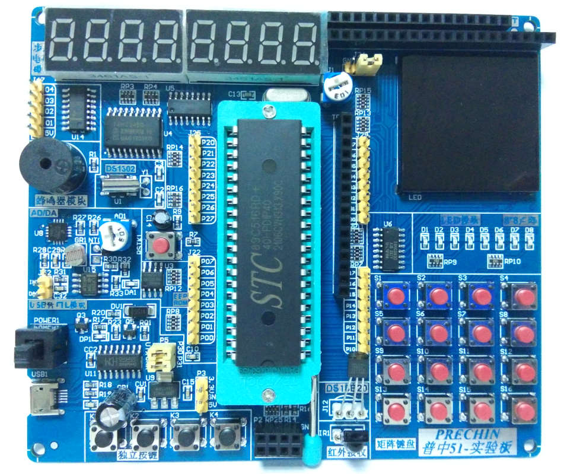
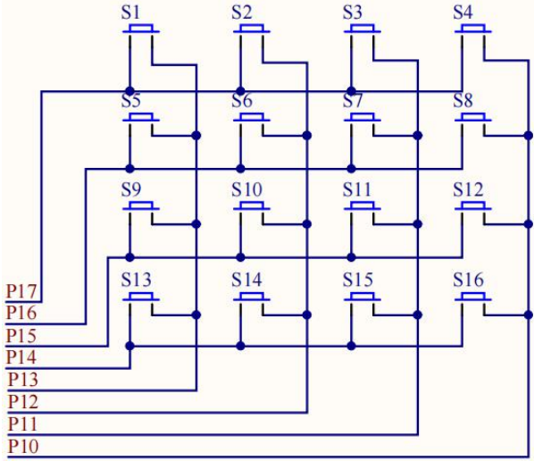

# AT89C51系列开发板_矩阵按键
在普中-4开发板上的一个关于4*4矩阵按键的简单项目

本程序是基于AT89C51的开发板上的4*4矩阵的控制与效果实现。
当从左向右依次按下矩阵按键后，可以在一位共阳极数码管上显示符号0-9，A-F。
其矩阵按键扫描的思想可以移植，至于输出的效果可以更改成其他输出设备或程序模块。
矩阵占据单片机的P1口的8位，数码管占据P0的8位端口。

# 硬件设备
## 开发板如图所示，可以使用其他开发板，这里只做参考


## 矩阵电路的连接如下所示


由图可见，P1的高四位P17、P16、P15、P14，是用来判断行，
P1的第四位P13、P12、P11、P10是用来判断列。
当某个按键按下，则导致在这个按键交叉相连的两个端口会导通，即当这个端口中有任意一个是置低位，那么另一个读取到的数据为置低位。

# 具体程序
## 全部程序
先上程序，具体方法讲解后面再提
```c
#include "reg52.h"

typedef unsigned int u16;	//对系统默认数据类型进行重定义
typedef unsigned char u8;

#define KEY_MATRIX_PORT	P1	//使用宏定义矩阵按键控制口	

#define SMG_A_DP_PORT	P0	//使用宏定义数码管段码口


//共阴极数码管显示0~F的段码数据
u8 gsmg_code[16]={0x3f,0x06,0x5b,0x4f,0x66,0x6d,0x7d,0x07,
				0x7f,0x6f,0x77,0x7c,0x39,0x5e,0x79,0x71};	

void delay_10us(u16 ten_us)
{
	while(ten_us--);	
}

// 二维矩阵存储按键状态
u8 key_matrix[4][4] = {
						{0x77,0x7b,0x7d,0x7e},
						{0xb7,0xbb,0xbd,0xbe},
						{0xd7,0xdb,0xdd,0xde},
						{0xe7,0xeb,0xed,0xee}	
						};  

// 一维矩阵存储按照行扫描的方式
u8 key_cows[4] = {0x7f,0xbf,0xdf,0xef};

u8 key_value = 0;

void scan_keys()
{
	u8 i,j;
	for(i=0;i<4;i++)
	{
		KEY_MATRIX_PORT = key_cows[i];
		if( KEY_MATRIX_PORT != key_cows[i] )//判断第一列按键是否按下
		{
				for(j=0;j<4;j++)
			{
				delay_10us(550);//消抖
				if(KEY_MATRIX_PORT == key_matrix[i][j])
				{
					key_value = 4*i+j;
				}
			}
		}
	}
}

void main()
{	
	while(1)
	{
		scan_keys();
	   	SMG_A_DP_PORT = gsmg_code[key_value];
	}		
}
```

## 快速移植
下面这部分是移植的时候要保留的部分

```c
typedef unsigned char u8;	//对系统默认数据类型进行重定义

#define KEY_MATRIX_PORT	P1	//使用宏定义矩阵按键控制口
// 二维矩阵存储按键状态
u8 key_matrix[4][4] = {
						{0x77,0x7b,0x7d,0x7e},
						{0xb7,0xbb,0xbd,0xbe},
						{0xd7,0xdb,0xdd,0xde},
						{0xe7,0xeb,0xed,0xee}	
						};  

// 一维矩阵存储按照行扫描的方式
u8 key_cows[4] = {0x7f,0xbf,0xdf,0xef};

u8 key_value = 0; //全局变量key_value，用来跨全局传递按键数字

//按键扫描函数，可循环扫描当前按下的按键位置，并将按下的按键位置信息放到全局变量value里面
void scan_keys()
{
	u8 i,j;
	for(i=0;i<4;i++)
	{
		KEY_MATRIX_PORT = key_cows[i];
		if( KEY_MATRIX_PORT != key_cows[i] )//判断第一列按键是否按下
		{
				for(j=0;j<4;j++)
			{
				delay_10us(550);//消抖
				if(KEY_MATRIX_PORT == key_matrix[i][j])
				{
					key_value = 4*i+j;
				}
			}
		}
	}
}

```

## 主函数内调用方法
每次需要了解当前哪个按键按下的时候，直接将子函数scan_keys()声明即可，然后紧接着直接使用key_value这个全局变量即可知道哪个按键按下。
```c
void main()
{	
	while(1)
	{
		scan_keys();
	   	SMG_A_DP_PORT = gsmg_code[key_value];//这里将按键的位置信息与数码管的显示数字信息相互对应
	}		
}
```
